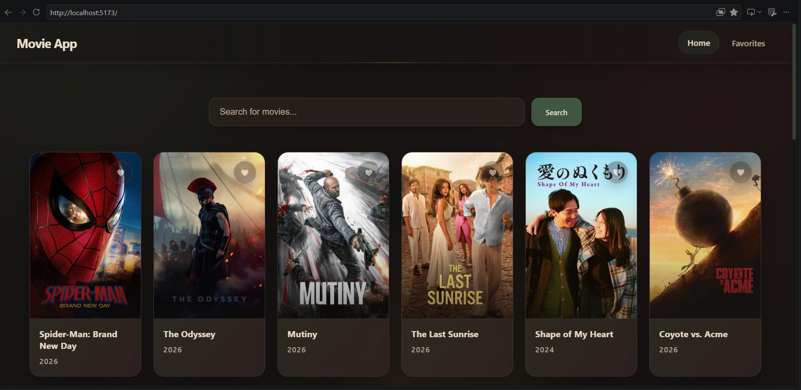
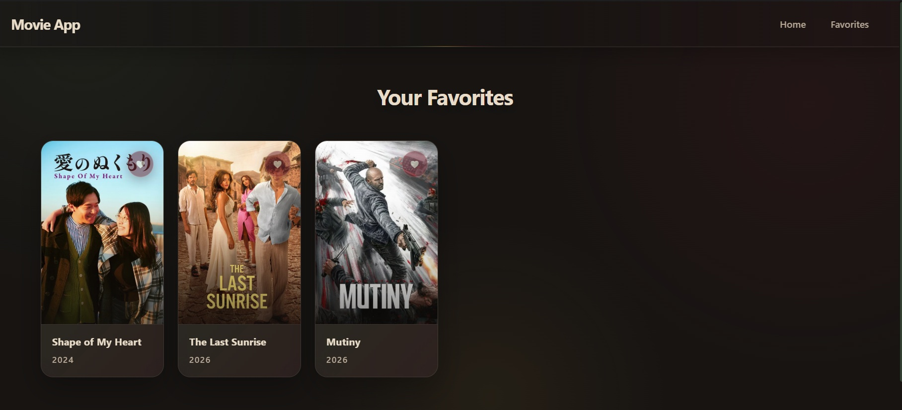

# 🎬 React Movie App

A responsive movie application built with React and the TMDB API.

The application allows users to browse popular movies, search for movies, and save their favorite movies.

Favorite movies are stored in the browser using `localStorage`, so they remain available after refreshing or reopening the application.

The UI uses a modern glassmorphism design with an earthy / nude color palette including olive green, burgundy, cream, brown, and mustard.

---

## 📸 Project Preview

### Home Page



### Favorites Page




---

## ✨ Features

- Browse popular movies from TMDB
- Search for movies
- Display movie posters
- Display movie titles
- Display movie release years
- Add movies to favorites
- Remove movies from favorites
- Separate Favorites page
- Persist favorites using `localStorage`
- Responsive layout for desktop, tablet, and mobile
- Glassmorphism-inspired UI
- Loading states
- Error states
- Client-side routing without reloading the whole website

---

## 🛠 Technologies Used

- React
- JavaScript
- JSX
- CSS
- Vite
- React Router
- React Context API
- TMDB API
- localStorage
- Git
- GitHub

---

# 🧠 React Concepts Used

This project was created as a learning project to practice the main concepts of React.

---

## Components

React applications are divided into reusable pieces called **components**.

This project contains components such as:

- `NavBar`
- `MovieCard`
- `Home`
- `Favorites`

Example:

```jsx
function MovieCard({ movie }) {
  return (
    <div className="movie-card">
      <h3>{movie.title}</h3>
    </div>
  );
}
```

A component can be reused multiple times with different data.

---

## JSX

JSX allows us to write HTML-like syntax inside JavaScript.

Example:

```jsx
<h3>{movie.title}</h3>
```

The curly braces:

```jsx
{ }
```

allow JavaScript values or expressions to be used inside JSX.

---

## Props

Props allow data to be passed from one component to another.

Example:

```jsx
<MovieCard movie={movie} key={movie.id} />
```

Here:

```text
movie={movie}
```

passes the movie object to the `MovieCard` component.

Inside `MovieCard` we receive it like this:

```jsx
function MovieCard({ movie }) {
  return <h3>{movie.title}</h3>;
}
```

---

## State

State is data that React remembers and that can change while the application is running.

This project uses state for:

- Search text
- Movie list
- Loading status
- Error messages
- Favorite movies

Example:

```jsx
const [movies, setMovies] = useState([]);
```

Here:

```text
movies
```

is the current value.

```text
setMovies
```

is the function used to update it.

```text
[]
```

is the initial value.

When state changes, React re-renders the component.

The whole browser page does not reload.

---

## useState

`useState` is a React Hook used to create state.

Example:

```jsx
const [searchQuery, setSearchQuery] = useState("");
```

Meaning:

```text
searchQuery
→ current search text

setSearchQuery
→ function used to update the search text

""
→ initial empty value
```

---

## useEffect

`useEffect` lets a React component run side effects.

Examples of side effects include:

- API calls
- Timers
- localStorage
- Event listeners

In this project, `useEffect` is used to load popular movies from TMDB when the Home component first loads.

Example:

```jsx
useEffect(() => {
  loadPopularMovies();
}, []);
```

The empty dependency array:

```jsx
[]
```

means the effect runs when the component first loads.

Other examples:

```jsx
useEffect(() => {
}, [searchQuery]);
```

runs when `searchQuery` changes.

Without a dependency array:

```jsx
useEffect(() => {
});
```

the effect runs after every render.

---

# 🌐 API

API means:

> A way for applications to communicate with each other.

Fetching an API means:

> Requesting data from another server and using the returned data in our application.

This project uses the TMDB API.

---

## Popular Movies API

The application requests popular movies from:

```text
/movie/popular
```

Example:

```js
export const getPopularMovies = async () => {
  const response = await fetch(
    `${BASE_URL}/movie/popular?api_key=${API_KEY}`
  );

  const data = await response.json();

  return data;
};
```

The movie list returned by TMDB is stored inside:

```text
data.results
```

So in `Home.jsx`:

```jsx
const popularMovies = await getPopularMovies();

setMovies(popularMovies.results);
```

---

## Search Movies API

Movie searching uses:

```text
/search/movie
```

Example:

```js
export const searchMovies = async (query) => {
  const response = await fetch(
    `${BASE_URL}/search/movie?api_key=${API_KEY}&query=${encodeURIComponent(query)}`
  );

  const data = await response.json();

  return data;
};
```

---

## async / await

API requests take time.

We use:

```js
async
```

to create an asynchronous function.

And:

```js
await
```

to wait for the API response.

Example:

```js
const searchResults = await searchMovies(searchQuery);
```

---

## try / catch / finally

API calls can fail.

We use:

```js
try
```

to attempt the request.

```js
catch
```

runs if an error happens.

```js
finally
```

always runs after `try` and `catch`.

Example:

```jsx
try {
  const popularMovies = await getPopularMovies();

  setMovies(popularMovies.results);
} catch (err) {
  console.log(err);

  setError("Failed to fetch popular movies.");
} finally {
  setLoading(false);
}
```

---

# ⏳ Loading State

Loading state remembers whether the application is still waiting for the API.

Example:

```jsx
const [loading, setLoading] = useState(true);
```

Before the API request:

```jsx
setLoading(true);
```

After it finishes:

```jsx
setLoading(false);
```

The UI then uses conditional rendering:

```jsx
{loading ? (
  <div className="loading">Loading...</div>
) : (
  <div className="movies-grid">
    ...
  </div>
)}
```

---

# ⚠️ Error State

The application stores API errors inside state.

Example:

```jsx
const [error, setError] = useState(null);
```

If something fails:

```jsx
setError("Failed to fetch popular movies.");
```

The error is displayed with:

```jsx
{error && <div className="error-message">{error}</div>}
```

---

# 🔄 map()

`map()` is used to go through an array and create React elements.

Example:

```jsx
{movies.map((movie) => (
  <MovieCard movie={movie} key={movie.id} />
))}
```

Meaning:

```text
movies
↓
movie 1 → MovieCard
movie 2 → MovieCard
movie 3 → MovieCard
...
```

---

# 🔑 key

When React renders a list, each item needs a unique key.

Example:

```jsx
key={movie.id}
```

The movie ID is unique, so React can identify each MovieCard.

---

# 🧭 React Router

React Router is used for client-side navigation.

It allows the user to move between pages without reloading the whole website.

Routes in this project:

```text
/            → Home page
/favorites   → Favorites page
```

Example:

```jsx
<Routes>
  <Route path="/" element={<Home />} />
  <Route path="/favorites" element={<Favorites />} />
</Routes>
```

---

## BrowserRouter

`BrowserRouter` enables routing for the application.

It wraps the main App component:

```jsx
<BrowserRouter>
  <App />
</BrowserRouter>
```

---

## Link

`Link` allows users to move between routes without refreshing the entire page.

Example:

```jsx
<Link to="/">Home</Link>

<Link to="/favorites">Favorites</Link>
```

---

# 🌍 Context API

The React Context API allows shared data to be accessed by multiple components.

Without Context, data may need to be passed through many components.

This is called:

```text
Prop Drilling
```

Prop drilling means:

> Passing props through multiple components just to reach a deeper component.

Context avoids this.

---

## MovieContext

This project uses:

```text
MovieContext.jsx
```

to manage favorite movies.

The Context provides:

```text
favorites
addToFavorites()
removeFromFavorites()
isFavorite()
```

Components can access them using:

```jsx
useMovieContext();
```

Example:

```jsx
const {
  isFavorite,
  addToFavorites,
  removeFromFavorites
} = useMovieContext();
```

---

## MovieProvider

The provider wraps the application:

```jsx
<MovieProvider>
  <App />
</MovieProvider>
```

All components inside the provider can access the shared Context data.

---

# ❤️ Favorites

The favorite movie state is stored as an array:

```jsx
const [favorites, setFavorites] = useState([]);
```

---

## Add to Favorites

A movie is added using:

```jsx
setFavorites((prev) => [...prev, movie]);
```

The spread operator:

```js
...
```

copies the previous movies.

Example:

```text
[movie1, movie2]
```

becomes:

```text
[movie1, movie2, movie3]
```

---

## Remove from Favorites

Movies are removed using `filter()`:

```jsx
setFavorites((prev) =>
  prev.filter((movie) => movie.id !== movieId)
);
```

`filter()` creates a new array without the selected movie.

---

## Check Favorite

The project uses:

```js
some()
```

to check if a movie already exists inside favorites.

Example:

```jsx
return favorites.some(
  (movie) => movie.id === movieId
);
```

This returns:

```text
true
```

or:

```text
false
```

---

# 💾 localStorage

`localStorage` allows the browser to save information locally.

Unlike normal state, this information can remain after refreshing or closing the website.

Favorites are loaded with:

```js
localStorage.getItem("favorites");
```

Because localStorage stores text, the saved value is converted back into JavaScript using:

```js
JSON.parse();
```

Example:

```jsx
const storedFavs = localStorage.getItem("favorites");

if (storedFavs) {
  setFavorites(JSON.parse(storedFavs));
}
```

---

## Save to localStorage

The favorites array must first be converted into text.

We use:

```js
JSON.stringify();
```

Example:

```jsx
localStorage.setItem(
  "favorites",
  JSON.stringify(favorites)
);
```

---

# 🔐 Environment Variables

The TMDB API key is stored inside a `.env` file.

The `.env` file should not be committed to GitHub.

Example:

```env
VITE_TMDB_API_KEY=YOUR_TMDB_API_KEY
```

Inside `api.js`:

```js
const API_KEY = import.meta.env.VITE_TMDB_API_KEY;
```

The `.env` file is ignored using `.gitignore`:

```gitignore
.env
```

---

# 🎨 UI Design

The project uses a modern glassmorphism-inspired design.

The color palette includes:

- Olive Green
- Burgundy
- Cream
- Brown
- Mustard
- Dark Brown

---

## CSS Variables

Main colors are defined once in `index.css`.

Example:

```css
:root {
  --background: #171412;
  --surface: #211c19;
  --green: #405542;
  --burgundy: #6b1e2b;
  --cream: #e8dcc8;
  --brown: #5a3a2e;
  --mustard: #c79a3b;
}
```

They can then be reused:

```css
background-color: var(--green);

color: var(--cream);
```

---

# 🪟 Glassmorphism

The UI uses transparent surfaces combined with blur effects.

Example:

```css
background: rgba(44, 37, 33, 0.55);

backdrop-filter: blur(18px);

border: 1px solid rgba(232, 220, 200, 0.14);
```

This creates the glass-like appearance.

---

# 🎨 Gradients

The project uses gradients for subtle design details.

Example:

```css
background: linear-gradient(
  90deg,
  var(--green),
  var(--mustard),
  var(--burgundy)
);
```

This creates:

```text
green → mustard → burgundy
```

---

## radial-gradient

A radial gradient spreads color from one point outward.

Example:

```css
background:
  radial-gradient(
    circle at 10% 5%,
    rgba(64, 85, 66, 0.18),
    transparent 30%
  );
```

It is useful for creating soft background glow effects.

---

# ✨ CSS Pseudo-elements

Pseudo-elements allow us to create decorative elements without changing JSX.

Example:

```css
.favorites-empty::before {
  content: "";
  display: block;

  width: 56px;
  height: 4px;
}
```

The `::before` pseudo-element creates a virtual element before the real content.

---

# 📐 CSS Grid

Movie cards are displayed using CSS Grid.

Example:

```css
.movies-grid {
  display: grid;

  grid-template-columns:
    repeat(auto-fill, minmax(190px, 1fr));

  gap: 1.4rem;
}
```

---

## minmax()

Example:

```css
minmax(190px, 1fr)
```

Meaning:

```text
190px
→ minimum card width

1fr
→ card can grow and share available space
```

---

## auto-fill

Example:

```css
repeat(auto-fill, ...)
```

The browser automatically calculates how many columns fit inside the available space.

---

# 📱 Responsive Design

Media queries are used to change the layout depending on screen size.

Example:

```css
@media (max-width: 768px) {
  .navbar {
    padding: 0.9rem 1rem;
  }
}
```

This applies the styles when the screen is `768px` wide or smaller.

---

# 📁 Project Structure

```text
frontend/
│
├── public/
│
├── src/
│   │
│   ├── assets/
│   │
│   ├── components/
│   │   ├── MovieCard.jsx
│   │   └── NavBar.jsx
│   │
│   ├── contexts/
│   │   └── MovieContext.jsx
│   │
│   ├── css/
│   │   ├── App.css
│   │   ├── Favorites.css
│   │   ├── Home.css
│   │   ├── index.css
│   │   ├── MovieCard.css
│   │   └── NavBar.css
│   │
│   ├── pages/
│   │   ├── Favorites.jsx
│   │   └── Home.jsx
│   │
│   ├── services/
│   │   └── api.js
│   │
│   ├── App.jsx
│   └── main.jsx
│
├── .gitignore
├── index.html
├── package.json
├── package-lock.json
├── README.md
└── vite.config.js
```

---

# 🚀 Running the Project Locally

## 1. Clone the repository

```bash
git clone git@github.com:shirinmohajeri/react-movie-app.git
```

---

## 2. Enter the project

```bash
cd react-movie-app
```

---

## 3. Install dependencies

```bash
npm install
```

---

## 4. Create the `.env` file

Create:

```text
.env
```

and add:

```env
VITE_TMDB_API_KEY=YOUR_TMDB_API_KEY
```

---

## 5. Start the development server

```bash
npm run dev
```

Vite will display a local address, usually:

```text
http://localhost:5173/
```

Open it in the browser.

---

# 📦 Production Build

To create a production version:

```bash
npm run build
```

Vite creates the production files inside:

```text
dist/
```

---

# 🧰 Git Workflow

Git is used to track changes in the project.

---

## Check project status

```bash
git status
```

---

## Stage changes

```bash
git add .
```

---

## Create a commit

```bash
git commit -m "Describe your changes"
```

---

## Push changes to GitHub

```bash
git push
```

After the initial setup, the normal workflow is:

```bash
git add .
git commit -m "Describe your changes"
git push
```

---

# 📚 What I Learned

During this project I practiced:

- Creating a React project with Vite
- Starting a Vite development server
- JSX
- Components
- Props
- State
- `useState`
- `useEffect`
- API fetching
- `async / await`
- `try / catch / finally`
- Loading states
- Error handling
- `map()`
- React keys
- Conditional rendering
- Controlled inputs
- React Router
- `BrowserRouter`
- `Routes`
- `Route`
- `Link`
- Context API
- Custom hooks
- Prop drilling
- localStorage
- `JSON.parse`
- `JSON.stringify`
- Environment variables
- CSS Grid
- Flexbox
- CSS variables
- CSS gradients
- Pseudo-elements
- Glassmorphism
- Responsive design
- Git repositories
- Git commits
- Git remotes
- GitHub push workflow

---

# 🔮 Possible Future Improvements

Future versions could include:

- Movie details page
- Movie ratings
- Genre filters
- Sorting
- Pagination
- Better search behavior
- Search suggestions
- Loading skeletons
- Missing poster fallback
- Active navbar indicator
- Movie overview
- Cast information
- Trailer support
- Theme switching
- Public deployment

---

# 👩‍💻 Author

**Shirin Mohajeri**

Built as a React learning project.